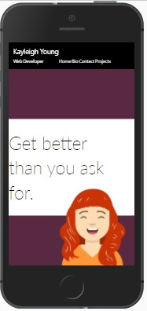
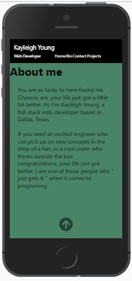
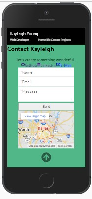
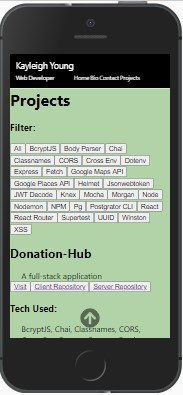
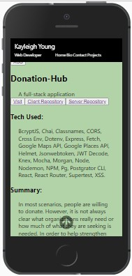

# My Portfolio Client 
## Links
* VERCEL URL: https://kay-the-web-dev.vercel.app  
* Client Git: https://github.com/kayleighkat98/portfolio-client    
## Screenshot(s)

## Summary
This client is made to display my portfolio (you can find the link above).I use it to display detailed data about my past projects including my role, images of the project, steps of the production process and of course, the final result!
## Technology
### REGULAR DEPENDENCIES:
* react
* react-dom
* react-icons
* react-router-dom
* react-scripts
* web-vitals
* @testing-library/jest-dom
* @testing-library/react
* @testing-library/user-event
### DEV DEPENDENCIES:
* cross-env
### MISC
* formspree.io
